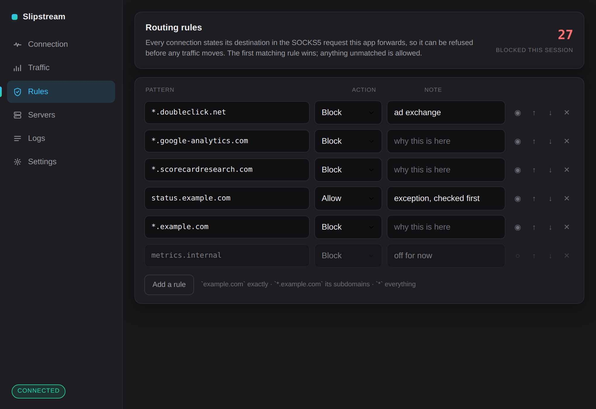
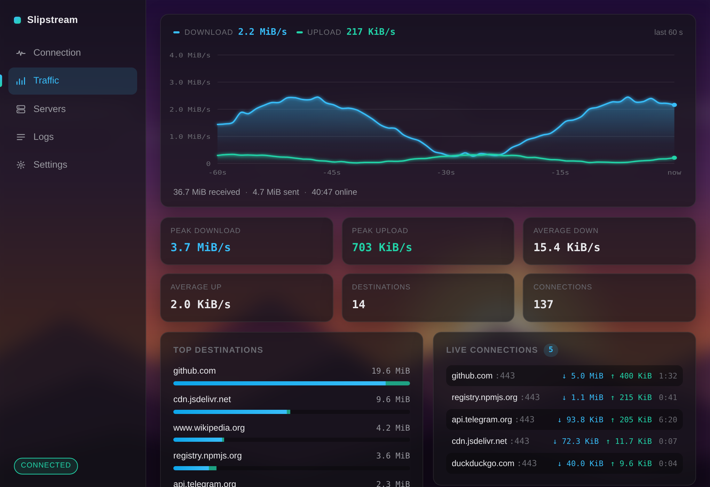
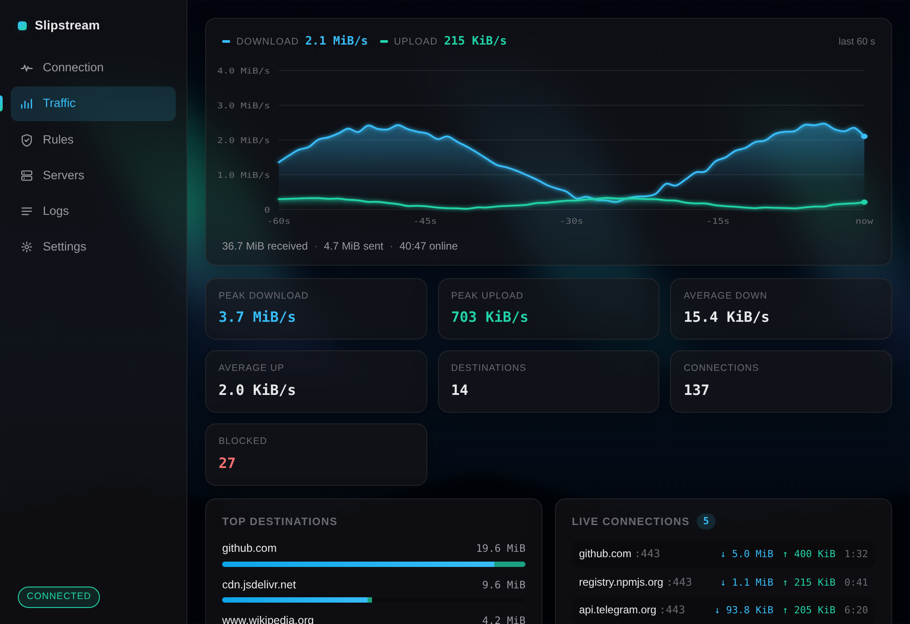

<div align="center">

**English** · [Русский](README.ru.md)


### Desktop client for the [slipstream](https://github.com/Mygod/slipstream-rust) DNS tunnel

Linux · Windows

[](LICENSE)
[](https://tauri.app)
[](https://github.com/Mygod/slipstream-rust/releases/tag/v0.1.1)
[](https://github.com/SpecFlowdev/slipstream-installer)

[**Download**](https://github.com/SpecFlowdev/slipstream-client/releases/latest) · [Server installer](https://github.com/SpecFlowdev/slipstream-installer)

</div>

---

<div align="center">
  
</div>

---

## What it does

Keeps your tunnel servers in one place and turns the one you pick into a **local SOCKS5 proxy**. Point a browser or any SOCKS-aware application at that port and its traffic leaves through your server, carried inside ordinary DNS queries.

The tunnel engine is the upstream `slipstream-client` binary, shipped alongside the app and supervised by it. The app owns the port you configure and forwards to the engine, so **every figure on screen is measured, not guessed** — including which destinations your traffic actually went to.

Set up the other end with the [server installer](https://github.com/SpecFlowdev/slipstream-installer); it prints every value this app asks for.

---

## Download

Grab the latest build from [Releases](https://github.com/SpecFlowdev/slipstream-client/releases/latest).

| Platform | File |
| --- | --- |
| Windows | `…-setup.exe` |
| Debian, Ubuntu, Mint | `…-linux-x86_64.deb` |
| Fedora, RHEL, openSUSE | `…-linux-x86_64.rpm` |
| Any Linux, no install | `…-linux-x86_64.tar.gz` or `…AppImage` |

There is an **[Android client](android/)** as well, with the same servers, the
same rules and the same numbers. It is built by the `Android APK` workflow
rather than published to Releases so far.

Every file ships with a `.sha256` next to it:

```sh
sha256sum -c slipstream-client-0.1.6-linux-x86_64.deb.sha256
```

---

## Features

### Traffic you can actually see

A live dashboard rather than a pair of numbers. Throughput is drawn as a smoothed, dual-series graph over the last minute with a real byte-rate axis; alongside it sit session peaks and averages, and two tables that answer the question a proxy normally cannot: **where did the traffic go**.

Destinations are read out of the SOCKS5 requests already passing through the app — the relay looks at the handshake it is forwarding anyway, never at payload, and never alters a byte. Nothing is resolved externally and nothing leaves the machine; the record is held in memory for the life of the session and dropped on disconnect.

<table>
  <tr>
    <td width="50%"></td>
    <td width="50%"></td>
  </tr>
  <tr>
    <td align="center"><strong>Traffic</strong> — graph, peaks, destinations, live connections</td>
    <td align="center"><strong>Connection</strong> — one switch, and what it is doing</td>
  </tr>
</table>

### Rules that actually refuse traffic

Because the relay reads the destination out of every SOCKS5 request it forwards, it can also **refuse the connection before a single byte of payload moves**. That is a real filter, not a display: a blocked host gets a closed socket.

| Pattern | Matches |
| --- | --- |
| `example.com` | that host exactly |
| `*.example.com` | its subdomains, but not `example.com` itself — and never `notexample.com` |
| `*` | everything, useful as a last-resort default |

The first matching rule wins, so an `allow` above a broad `block` is how an exception is written. Rules apply to the tunnel already running — no reconnect — and a rule can be switched off without deleting it.

<div align="center">
  
</div>

### Tuning that reaches the engine

The performance controls are the tunnel binary's own flags, not decoration:

| Control | Flag | What it changes |
| --- | --- | --- |
| **BBR / dCUBIC** | `--congestion-control` | BBR paces to the bandwidth and round-trip time it measures. dCUBIC reads any loss as congestion and backs off — which costs real speed over DNS, where loss is routine. **BBR is the default and usually the faster choice.** |
| **Segmentation offload** | `--gso` | Lets the kernel split one large UDP write into many packets, so far fewer system calls carry the same traffic. A clear throughput win where supported. |
| **Keep-alive** | `--keep-alive-interval` | How often the tunnel holds NAT and resolver state open. Lower survives aggressive networks at the cost of idle traffic. |
| **Authoritative server** | `--authoritative` | Query the zone's server directly instead of a recursive resolver: faster, and far more conspicuous. |

Values are validated against what the binary actually accepts, so a bad setting is refused when you save it rather than becoming a tunnel that will not start.

<div align="center">
  
</div>

### Everything else

- **Server profiles** — domain, resolver, pinned certificate, local port, proxy credentials and tuning, stored per server. Paste a certificate's contents straight in, or pick the file
- **Kill switch** — refuses new connections and drops active ones on this app's SOCKS5 port whenever the tunnel is not connected, so it fails closed instead of quietly hanging
- **System proxy** — optionally points this computer's own proxy setting at the tunnel while connected and restores it on disconnect, so applications need no setup of their own *(see the note on TUN below)*
- **Session history** — every finished session is kept with its duration, totals and peak rate, so the app shows more than the one running now
- **Log viewer** — the tunnel's own output, filtered by level, with follow-the-tail
- **Three themes and two languages** — dark gray, blue or light, English or Russian, each following the system or pinned
- **Custom wallpaper** — any image, in any theme, with dim and blur controls so the interface stays readable over it. The shots below are generated ones; drop your own into `assets/wallpapers/` and `scripts/screenshots.mjs` will capture the panel with it
- **Nothing leaves the device** — profiles, certificates, credentials and the traffic record live on your machine only

<table>
  <tr>
    <td width="50%"></td>
    <td width="50%"></td>
  </tr>
  <tr>
    <td align="center"><strong>Wallpaper</strong> — any theme, dimmed and blurred to taste</td>
    <td align="center"><strong>Light theme</strong> — or blue, or follow the system</td>
  </tr>
  <tr>
    <td width="50%"></td>
    <td width="50%"></td>
  </tr>
  <tr>
    <td align="center"><strong>A bright image</strong> — dimmed and blurred hard so text still wins</td>
    <td align="center"><strong>A dark one</strong> — needs almost no dimming at all</td>
  </tr>
  <tr>
    <td width="50%"></td>
    <td width="50%"></td>
  </tr>
  <tr>
    <td align="center"><strong>Servers</strong> — profiles and the editor</td>
    <td align="center"><strong>Settings</strong> — kill switch, appearance, network</td>
  </tr>
  <tr>
    <td width="50%"></td>
    <td width="50%"></td>
  </tr>
  <tr>
    <td align="center"><strong>Logs</strong> — tunnel output by level</td>
    <td align="center"><strong>Russian</strong> — switched in settings</td>
  </tr>
</table>

---

## Adding a server

| Field | Where it comes from |
| --- | --- |
| Tunnel domain | The domain you gave the server installer |
| Resolver | Your provider's resolver, e.g. `1.1.1.1:53`, or the server's own address |
| Certificate | `/etc/slipstream/cert.pem` on the server — paste it in or copy the file across |
| Local SOCKS5 port | Anything free; `1080` by default |
| Proxy username, password | Printed by the installer, also in `/etc/slipstream/socks-credentials` |

The certificate is optional but worth setting. Without it the server is not verified at all, so anyone able to answer your DNS queries can impersonate it — and would receive the proxy password your client sends.

---

## System-wide traffic, and what "not a TUN device" means

The **system proxy** switch in Settings points this computer's proxy configuration at the tunnel while it is connected, and puts your own configuration back on disconnect. Browsers and most desktop software honour that setting, so they go through the tunnel with nothing to configure per application.

That is not the same as a TUN device, and the app does not pretend otherwise. A TUN device captures every packet a machine sends whether the sending program likes it or not; the upstream tunnel exposes a SOCKS5 port and nothing else, so there is no packet-level path to capture. **Software that ignores the system proxy still bypasses the tunnel.** Full capture needs a userspace network stack in front of a TUN device, which is on the roadmap below rather than quietly implied here.

The kill switch has the same honest boundary: it closes *this app's* proxy port when the tunnel is down. It is not a system-wide firewall rule.

---

## Tuning the socket buffers (Linux)

The tunnel moves a lot of small UDP datagrams. On a busy link the kernel's
default socket buffers overflow, and the packets it drops look like loss to
QUIC, which backs off. Raising them to 25 MiB:

```sh
sudo tee /etc/sysctl.d/99-slipstream.conf >/dev/null <<'EOF'
net.core.rmem_max=26214400
net.core.wmem_max=26214400
net.core.rmem_default=26214400
net.core.wmem_default=26214400
EOF
sudo sysctl --system
```

The two `default` values are what change anything here: the tunnel never calls
`setsockopt(SO_RCVBUF)`, so its UDP socket gets whatever the default is. The
`max` pair only raises the ceiling an application may ask for.

They apply to **every** socket on the machine, so this trades memory across all
processes for tunnel throughput. Worth doing on a machine that is mostly running
the tunnel; on a shared one, set just the `max` pair. Windows needs no
equivalent — it sizes UDP buffers on its own.

Do the same on the server; its [installer](https://github.com/SpecFlowdev/slipstream-installer) documents it too.

---

## How it fits together

```
your app ──► 127.0.0.1:1080 ──► slipstream-tunnel ──► DNS ──► server ──► SOCKS5 ──► internet
             (this app:          (upstream binary,          (your VPS)
              counts bytes,       QUIC over DNS,
              reads SOCKS5        BBR or dCUBIC)
              destinations,
              kill switch)
```

The app never terminates the SOCKS5 session — it forwards it verbatim and reads the handshake in passing, which is what makes the destination figures possible without decrypting anything.

---

## Notes for Linux

Closing the window quits the app rather than minimising it. The system tray backend GTK apps normally use (`libayatana-appindicator`) triggers a fatal Wayland protocol error on several desktops, killing the process about a second after launch, so it is not built on Linux at all. On Wayland the app also relaunches itself under XWayland at startup, which is the configuration the WebView is reliable on.

WebKitGTK's DMA-BUF renderer is switched off by default here too. Left on, it leaves the window blank and prints `Failed to create GBM buffer … Invalid argument` on the NVIDIA proprietary driver, on virtualised GPUs, and anywhere else the DRM render node is not usable the way WebKit expects — it fails to draw at all rather than falling back. The software path is more than enough for charts and text. Set `WEBKIT_DISABLE_DMABUF_RENDERER=0` to take the accelerated path back if your system is fine with it.

The tray still works normally on Windows, where "close to tray" appears in Settings.

---

## Roadmap

- A userspace network stack in front of a TUN device, for capture that does not depend on applications honouring the proxy setting
- Android releases published alongside the desktop ones, signed rather than debug-built
- Profile import and export by link or QR
- Per-destination history kept across sessions, opt-in

---

## Building

```sh
npm ci
node scripts/fetch-sidecar.mjs     # downloads and verifies the tunnel binary
npm run tauri dev
```

`node scripts/screenshots.mjs` regenerates the images in this README from the built interface (needs `npm i --no-save playwright`).

---

## License

Apache-2.0. The tunnel engine is [Mygod/slipstream-rust](https://github.com/Mygod/slipstream-rust), distributed under its own licence.
