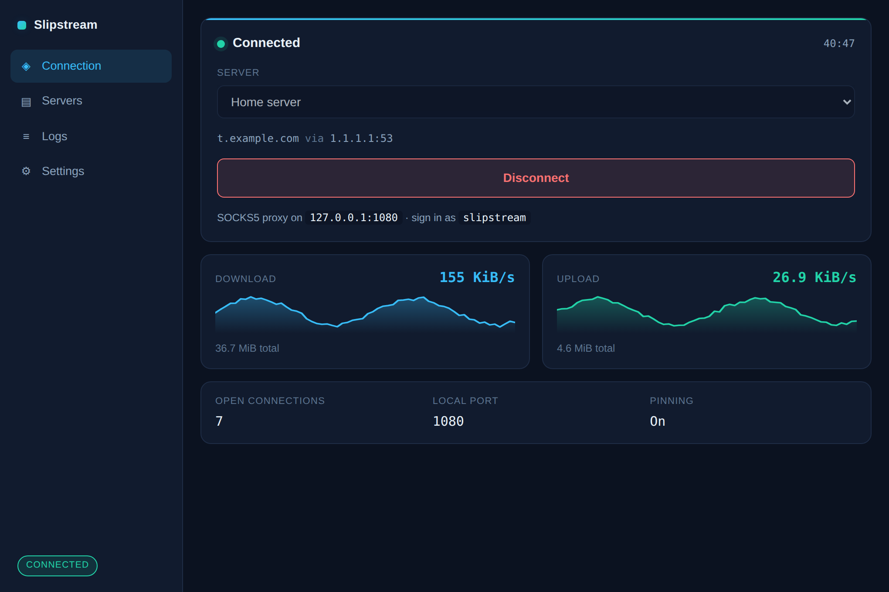
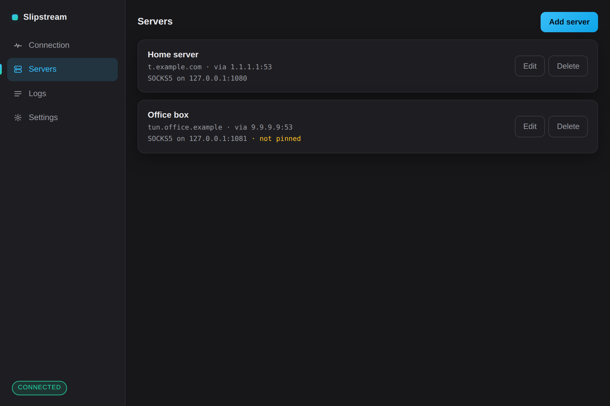
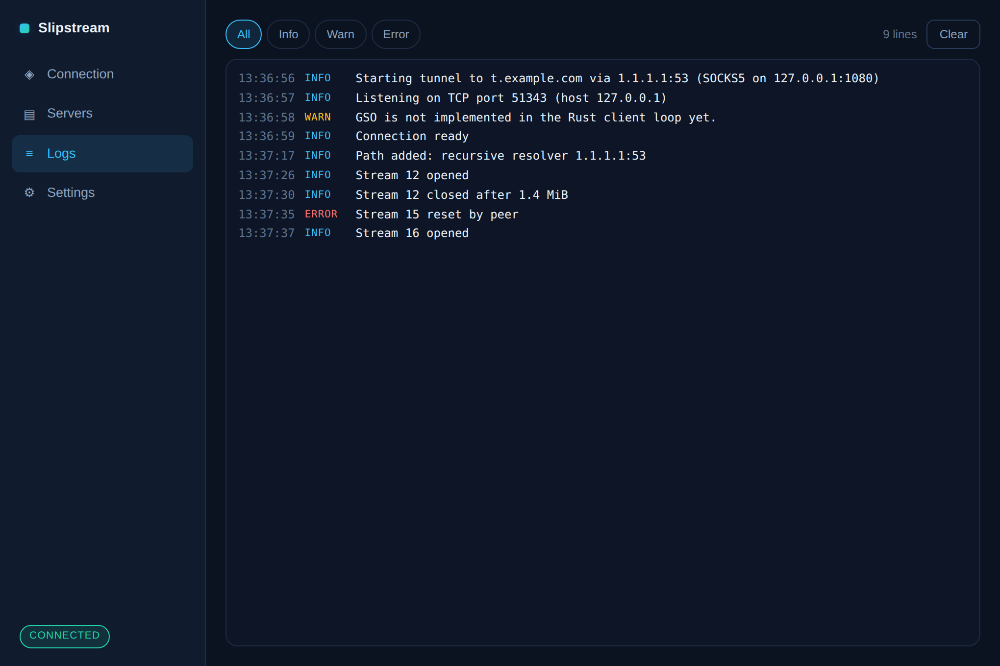
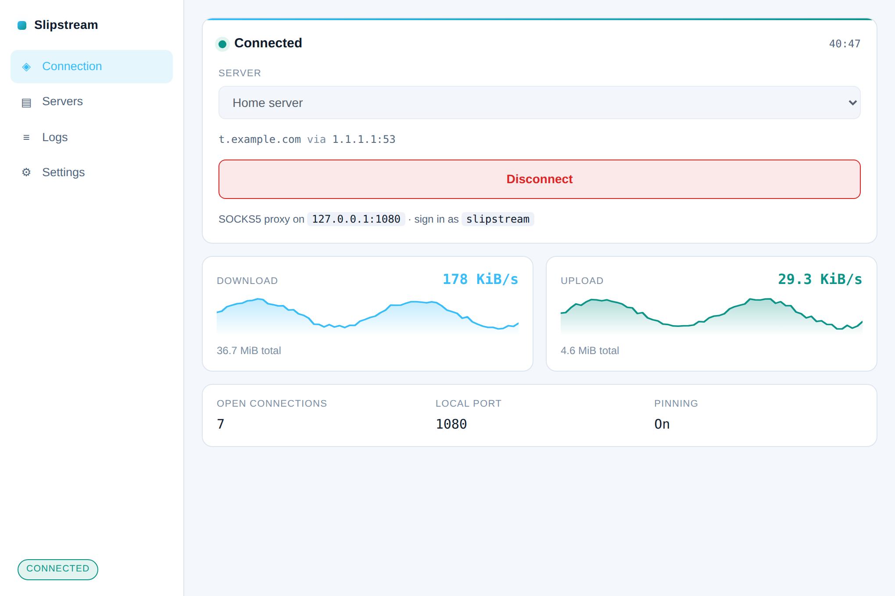
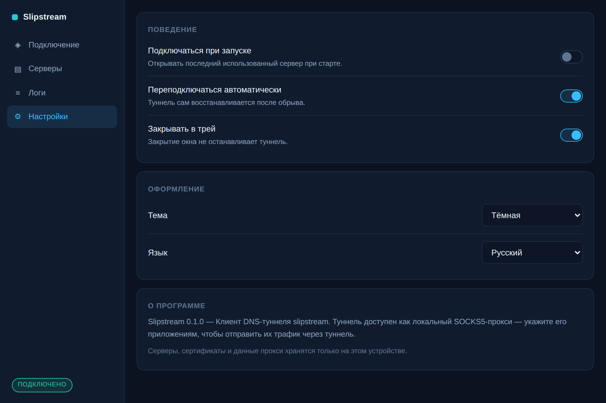

<div align="center">

[English](README.md) · **Русский**


### Десктопный клиент для DNS-туннеля [slipstream](https://github.com/Mygod/slipstream-rust)

Linux · Windows

[](LICENSE)
[](https://tauri.app)
[](https://github.com/Mygod/slipstream-rust/releases/tag/v0.1.1)
[](https://github.com/SpecFlowdev/slipstream-installer)

[**Скачать**](https://github.com/SpecFlowdev/slipstream-client/releases/latest) · [Установщик сервера](https://github.com/SpecFlowdev/slipstream-installer)

</div>

---

<div align="center">
  
</div>

---

## Скачать

Свежая сборка — в разделе [Releases](https://github.com/SpecFlowdev/slipstream-client/releases/latest).

| Система | Файл |
| --- | --- |
| Windows | `…-setup.exe` |
| Debian, Ubuntu, Mint | `…-linux-x86_64.deb` |
| Fedora, RHEL, openSUSE | `…-linux-x86_64.rpm` |
| Любой Linux, без установки | `…-linux-x86_64.tar.gz` или `…AppImage` |

Рядом с каждым файлом лежит `.sha256`:

```sh
sha256sum -c slipstream-client-0.1.0-linux-x86_64.deb.sha256
```

---

## Что он делает

Хранит ваши серверы в одном месте и превращает выбранный в **локальный SOCKS5-прокси**. Укажите этот порт браузеру или любому приложению с поддержкой SOCKS — и его трафик уйдёт через ваш сервер, упакованный в обычные DNS-запросы.

Движок туннеля — это upstream-бинарник `slipstream-client`, он идёт вместе с приложением и запускается им. Порт, который вы настраиваете, принадлежит самому приложению и форвардится в движок, поэтому цифры скорости на экране измерены, а не выдуманы.

Вторую сторону поднимает [установщик сервера](https://github.com/SpecFlowdev/slipstream-installer) — он печатает все значения, которые спрашивает это приложение.

---

## Возможности

- **Профили серверов** — домен, резолвер, пиннинг сертификата, локальный порт и логин с паролем прокси, отдельно для каждого сервера
- **Живая статистика** — графики приёма и отдачи за последнюю минуту, итоги сессии, число открытых соединений и время работы
- **Просмотр логов** — вывод самого туннеля с фильтром по уровню и автопрокруткой
- **Работа в трее** — закрытие окна не рвёт туннель; подключение при запуске включается по желанию
- **Светлая и тёмная темы, русский и английский** — по системным или принудительно
- **Ничего не покидает устройство** — профили, сертификаты и пароли лежат только в вашем каталоге конфигурации

---

## Экраны

<table>
  <tr>
    <td width="50%"></td>
    <td width="50%"></td>
  </tr>
  <tr>
    <td align="center"><strong>Серверы</strong> — профили и редактор</td>
    <td align="center"><strong>Логи</strong> — вывод туннеля по уровням</td>
  </tr>
  <tr>
    <td width="50%"></td>
    <td width="50%"></td>
  </tr>
  <tr>
    <td align="center"><strong>Светлая тема</strong> — или по системной</td>
    <td align="center"><strong>Русский язык</strong> — переключается в настройках</td>
  </tr>
</table>

---

## Как добавить сервер

| Поле | Откуда взять |
| --- | --- |
| Домен туннеля | Домен, который вы указали установщику сервера |
| Резолвер | Резолвер провайдера, например `1.1.1.1:53`, или адрес самого сервера |
| Сертификат | `/etc/slipstream/cert.pem` на сервере — скопируйте к себе |
| Локальный порт SOCKS5 | Любой свободный, по умолчанию `1080` |
| Логин и пароль прокси | Печатает установщик, они же в `/etc/slipstream/socks-credentials` |

Сертификат необязателен, но задать его стоит. Без него сервер не проверяется вообще, поэтому тот, кто может отвечать на ваши DNS-запросы, выдаст себя за него — и получит пароль от прокси, который отправит ваш клиент.

---

## Как это устроено

```
приложение ──► 127.0.0.1:1080 ──► slipstream-tunnel ──► DNS ──► сервер ──► SOCKS5 ──► интернет
               (это приложение,    (upstream-бинарник,          (ваш VPS)
                считает байты)      QUIC поверх DNS)
```

---

## Планы

- Системная маршрутизация через TUN вместо ручной настройки прокси
- Сборка под Android — сначала нужно кросс-компилировать туннель под NDK, готового бинарника upstream не публикует
- Импорт и экспорт профилей ссылкой или QR-кодом

---

## Лицензия

Apache-2.0. Движок туннеля — [Mygod/slipstream-rust](https://github.com/Mygod/slipstream-rust), распространяется по собственной лицензии.
