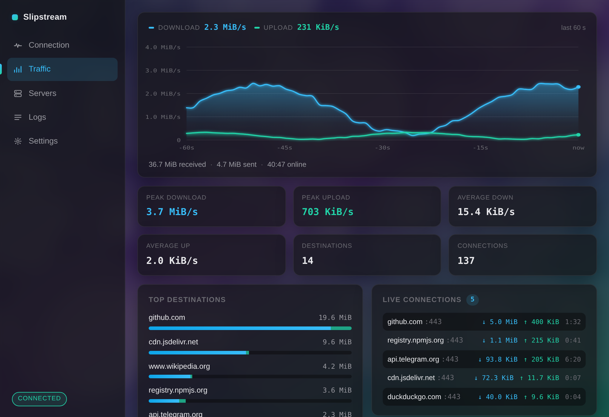
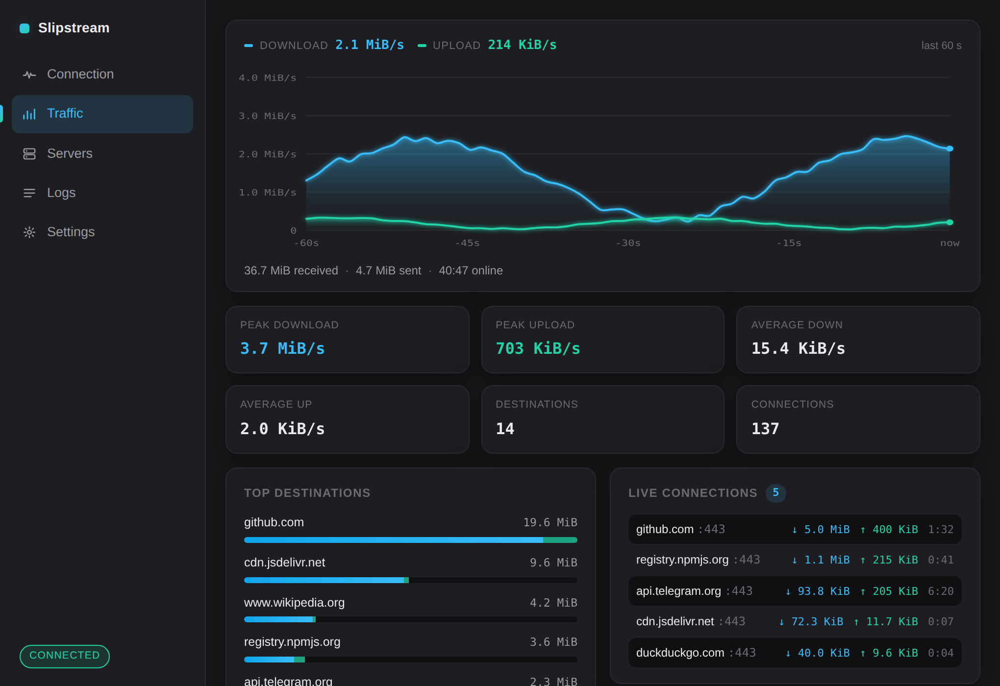
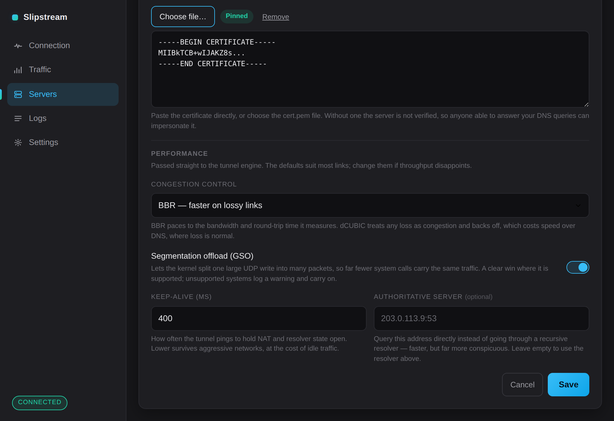
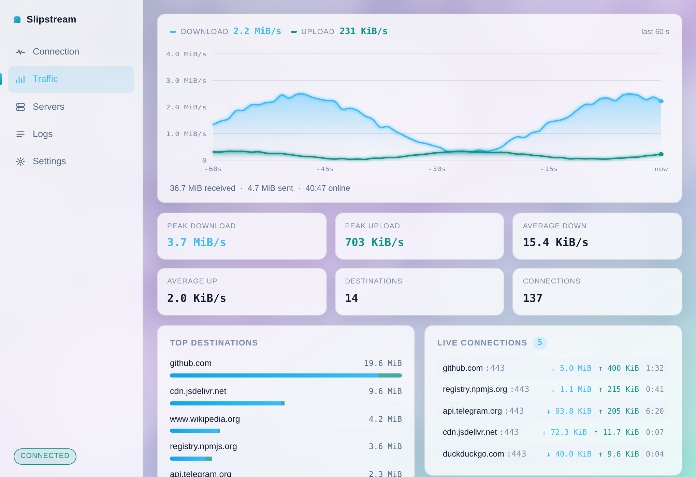
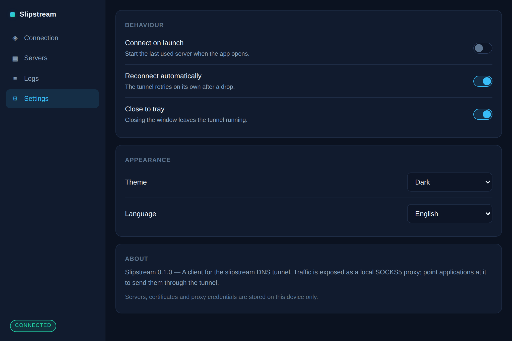

<div align="center">

[English](README.md) · **Русский**


### Десктопный клиент для DNS-туннеля [slipstream](https://github.com/Mygod/slipstream-rust)

Linux · Windows

[](LICENSE)
[](https://tauri.app)
[](https://github.com/Mygod/slipstream-rust/releases/tag/v0.1.1)
[](https://github.com/SpecFlowdev/slipstream-installer)

[**Скачать**](https://github.com/SpecFlowdev/slipstream-client/releases/latest) · [Установщик сервера](https://github.com/SpecFlowdev/slipstream-installer)

</div>

---

<div align="center">
  
</div>

---

## Что он делает

Хранит ваши серверы в одном месте и превращает выбранный в **локальный SOCKS5-прокси**. Укажите этот порт браузеру или любому приложению с поддержкой SOCKS — и его трафик уйдёт через ваш сервер, упакованный в обычные DNS-запросы.

Движок туннеля — upstream-бинарник `slipstream-client`, он идёт вместе с приложением и запускается им. Порт, который вы настраиваете, принадлежит самому приложению и форвардится в движок, поэтому **все цифры на экране измерены, а не выдуманы** — включая то, на какие адреса реально ушёл трафик.

Вторую сторону поднимает [установщик сервера](https://github.com/SpecFlowdev/slipstream-installer) — он печатает все значения, которые спрашивает это приложение.

---

## Скачать

Свежая сборка — в разделе [Releases](https://github.com/SpecFlowdev/slipstream-client/releases/latest).

| Система | Файл |
| --- | --- |
| Windows | `…-setup.exe` |
| Debian, Ubuntu, Mint | `…-linux-x86_64.deb` |
| Fedora, RHEL, openSUSE | `…-linux-x86_64.rpm` |
| Любой Linux, без установки | `…-linux-x86_64.tar.gz` или `…AppImage` |

Рядом с каждым файлом лежит `.sha256`:

```sh
sha256sum -c slipstream-client-0.1.6-linux-x86_64.deb.sha256
```

---

## Возможности

### Трафик, который видно

Полноценная панель вместо пары цифр. Скорость рисуется сглаженным графиком по двум сериям за последнюю минуту, с настоящей осью в байтах в секунду; рядом — пики и средние за сессию и две таблицы, отвечающие на вопрос, на который прокси обычно ответить не может: **куда именно ушёл трафик**.

Направления читаются из SOCKS5-запросов, которые и так проходят через приложение: релей смотрит на рукопожатие, которое всё равно пересылает, никогда не заглядывает в полезную нагрузку и не меняет ни байта. Ничего не резолвится наружу и никуда не отправляется — запись живёт в памяти на время сессии и пропадает при отключении.

<table>
  <tr>
    <td width="50%"></td>
    <td width="50%"></td>
  </tr>
  <tr>
    <td align="center"><strong>Трафик</strong> — график, пики, направления, соединения</td>
    <td align="center"><strong>Подключение</strong> — одна кнопка и что она делает</td>
  </tr>
</table>

### Настройки, которые доходят до движка

Параметры производительности — это собственные флаги бинарника туннеля, а не украшение:

| Параметр | Флаг | На что влияет |
| --- | --- | --- |
| **BBR / dCUBIC** | `--congestion-control` | BBR подстраивается под измеренную полосу и задержку. dCUBIC считает любую потерю перегрузкой и сбавляет скорость — а в DNS-туннеле потери это норма, так что это стоит реальной скорости. **BBR стоит по умолчанию и обычно быстрее.** |
| **Разгрузка сегментации** | `--gso` | Позволяет ядру разбивать одну большую UDP-запись на много пакетов: тот же трафик уходит за куда меньшее число системных вызовов. Там, где поддерживается, — заметный прирост. |
| **Keep-alive** | `--keep-alive-interval` | Как часто туннель напоминает о себе, чтобы NAT и резолвер не забыли соединение. Меньше — надёжнее на агрессивных сетях, но появляется холостой трафик. |
| **Авторитативный сервер** | `--authoritative` | Спрашивать сервер зоны напрямую, минуя рекурсивный резолвер: быстрее и гораздо заметнее. |

Значения проверяются на то, что бинарник действительно принимает, поэтому неверная настройка отклоняется при сохранении, а не превращается в туннель, который не стартует.

<div align="center">
  
</div>

### Всё остальное

- **Профили серверов** — домен, резолвер, пиннинг сертификата, локальный порт, логин с паролем прокси и настройки производительности, отдельно для каждого сервера. Сертификат можно вставить текстом или выбрать файлом
- **Kill switch** — блокирует новые и рвёт активные соединения на SOCKS5-порту приложения, пока туннель не поднят, вместо того чтобы тихо зависать
- **Системный прокси** — по желанию направляет системную настройку прокси на туннель, пока он поднят, и возвращает как было при отключении, так что приложениям ничего настраивать не нужно *(см. раздел про TUN ниже)*
- **Просмотр логов** — вывод самого туннеля с фильтром по уровню и автопрокруткой
- **Три темы и два языка** — тёмно-серая, синяя или светлая, русский или английский, по системным или принудительно
- **Свои обои** — в любой теме, с затемнением и размытием, чтобы интерфейс читался поверх любой картинки
- **Ничего не покидает устройство** — профили, сертификаты, пароли и запись о трафике лежат только на вашей машине

<table>
  <tr>
    <td width="50%"></td>
    <td width="50%"></td>
  </tr>
  <tr>
    <td align="center"><strong>Обои</strong> — в любой теме, затемнение и размытие по вкусу</td>
    <td align="center"><strong>Светлая тема</strong> — или синяя, или как в системе</td>
  </tr>
  <tr>
    <td width="50%"></td>
    <td width="50%"></td>
  </tr>
  <tr>
    <td align="center"><strong>Серверы</strong> — профили и редактор</td>
    <td align="center"><strong>Настройки</strong> — kill switch, оформление, сеть</td>
  </tr>
  <tr>
    <td width="50%"></td>
    <td width="50%"></td>
  </tr>
  <tr>
    <td align="center"><strong>Логи</strong> — вывод туннеля по уровням</td>
    <td align="center"><strong>Русский язык</strong> — переключается в настройках</td>
  </tr>
</table>

---

## Как добавить сервер

| Поле | Откуда взять |
| --- | --- |
| Домен туннеля | Домен, который вы указали установщику сервера |
| Резолвер | Резолвер провайдера, например `1.1.1.1:53`, или адрес самого сервера |
| Сертификат | `/etc/slipstream/cert.pem` на сервере — вставьте текстом или скопируйте файл |
| Локальный порт SOCKS5 | Любой свободный, по умолчанию `1080` |
| Логин и пароль прокси | Печатает установщик, они же в `/etc/slipstream/socks-credentials` |

Сертификат необязателен, но задать его стоит. Без него сервер не проверяется вообще, поэтому тот, кто может отвечать на ваши DNS-запросы, выдаст себя за него — и получит пароль от прокси, который отправит ваш клиент.

---

## Трафик всей системы и что значит «это не TUN»

Переключатель **системного прокси** в настройках направляет настройку прокси этого компьютера на туннель, пока он поднят, и возвращает вашу собственную конфигурацию при отключении. Браузеры и большинство десктопного софта эту настройку уважают, так что они идут через туннель без настройки в каждом приложении.

Это не то же самое, что TUN-устройство, и приложение не делает вид, что то же. TUN перехватывает каждый пакет машины независимо от того, хочет того отправляющая программа или нет; upstream-туннель отдаёт наружу SOCKS5-порт и больше ничего, так что перехватывать на уровне пакетов просто негде. **Программы, игнорирующие системный прокси, всё равно пойдут мимо туннеля.** Полный перехват требует пользовательского сетевого стека перед TUN-устройством — это в планах ниже, а не намёком здесь.

У kill switch та же честная граница: он закрывает порт *этого приложения*, когда туннель лежит. Это не правило системного файрвола.

---

## Настройка буферов сокетов (Linux)

Туннель гоняет много мелких UDP-датаграмм. На загруженном канале стандартные
буферы сокетов переполняются, и отброшенные ядром пакеты выглядят для QUIC как
потери — он снижает скорость. Поднять их до 25 МиБ:

```sh
sudo tee /etc/sysctl.d/99-slipstream.conf >/dev/null <<'EOF'
net.core.rmem_max=26214400
net.core.wmem_max=26214400
net.core.rmem_default=26214400
net.core.wmem_default=26214400
EOF
sudo sysctl --system
```

Реально работают здесь два параметра с `default`: туннель не вызывает
`setsockopt(SO_RCVBUF)`, поэтому его UDP-сокет получает ровно то, что задано по
умолчанию. Пара `max` лишь поднимает потолок, который приложение вправе
запросить.

Действуют они на **все** сокеты машины, то есть вы меняете память всех
процессов на пропускную способность туннеля. На машине, занятой в основном
туннелем, это оправдано; на общей — задайте только пару `max`. Для Windows
аналог не нужен, она подбирает размеры UDP-буферов сама.

То же стоит сделать на сервере — в его [установщике](https://github.com/SpecFlowdev/slipstream-installer) это тоже описано.

---

## Как это устроено

```
приложение ──► 127.0.0.1:1080 ──► slipstream-tunnel ──► DNS ──► сервер ──► SOCKS5 ──► интернет
               (это приложение:    (upstream-бинарник,          (ваш VPS)
                считает байты,      QUIC поверх DNS,
                читает адреса       BBR или dCUBIC)
                из SOCKS5,
                kill switch)
```

Приложение никогда не терминирует SOCKS5-сессию — оно пересылает её как есть и попутно читает рукопожатие. Именно поэтому статистика по направлениям возможна без расшифровки чего бы то ни было.

---

## Замечания для Linux

Закрытие окна завершает приложение, а не сворачивает его. Системный трей, которым обычно пользуются GTK-приложения (`libayatana-appindicator`), на нескольких окружениях вызывает фатальную ошибку протокола Wayland и убивает процесс примерно через секунду после запуска — поэтому на Linux он не собирается вообще. На Wayland приложение к тому же перезапускает само себя под XWayland при старте: это конфигурация, в которой WebView ведёт себя предсказуемо.

На Windows трей работает как обычно, и пункт «Закрывать в трей» там на месте.

---

## Планы

- Пользовательский сетевой стек перед TUN-устройством — перехват, не зависящий от того, уважает ли приложение настройку прокси
- Сборка под Android — сначала нужно кросс-компилировать туннель под NDK, готового бинарника upstream не публикует
- Импорт и экспорт профилей ссылкой или QR-кодом
- История по направлениям между сессиями, по желанию

---

## Сборка

```sh
npm ci
node scripts/fetch-sidecar.mjs     # скачивает и проверяет бинарник туннеля
npm run tauri dev
```

`node scripts/screenshots.mjs` пересобирает картинки для этого README из собранного интерфейса (нужен `npm i --no-save playwright`).

---

## Лицензия

Apache-2.0. Движок туннеля — [Mygod/slipstream-rust](https://github.com/Mygod/slipstream-rust), распространяется по собственной лицензии.
